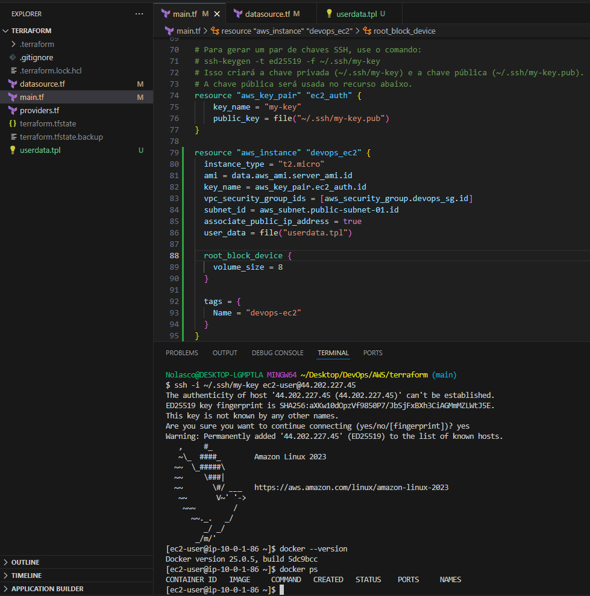

# DevOps AWS Terraform Environment


> Scripts Terraform para criar infraestrutura na AWS, incluindo uma VPC e uma instância EC2 com Docker instalado automaticamente via script de userdata. 💻
>
> Repositório criado para estudos e aprendizado 📚


<div align="center">
  
</div>


## Recursos Criados ️🌟

1. **VPC (Virtual Private Cloud):**
   - CIDR: `10.0.0.0/16`
   - DNS habilitado.


2. **Sub-rede pública:**
   - CIDR: `10.0.1.0/24`
   - Disponível na zona de disponibilidade `us-east-1a`.


3. **Internet Gateway (IGW):**
   - Associado à VPC.


4. **Tabela de rotas:**
   - Configurada para rotear tráfego de saída para o IGW.


5. **Security Group:**
   - Permite tráfego de entrada e saída de qualquer IP (`0.0.0.0/0`). **⚠️ Nota:** Alterar para um IP específico para maior segurança.


6. **Par de chaves SSH:**
   - Gerado localmente e usado para acesso à instância EC2.


7. **Instância EC2:**
   - Tipo: `t2.micro` (elegível para o nível gratuito da AWS).


   - Sistema operacional: Amazon Linux 2023.


   - Configuração automatizada para instalar e habilitar o Docker.


   - Volume de armazenamento de 8 GB.


## Estrutura dos Arquivos 🗂️

- `providers.tf`: Configuração do provedor AWS para Terraform.

  
- `userdata.tpl`: Script de inicialização para configurar o Docker na instância EC2.


- `datasource.tf`: Obtenção da AMI mais recente do Amazon Linux 2023.


- `main.tf`: Configuração principal contendo a VPC, sub-rede, tabela de rotas, IGW, Security Group, par de chaves SSH e a instância EC2.


## Pré-requisitos ✅

1. **Terraform instalado**: 
   - Consulte [a documentação oficial](https://developer.hashicorp.com/terraform/tutorials/aws-get-started/install-cli) para instalar.


2. **AWS CLI configurada**:
   - Execute `aws configure` para configurar suas credenciais.


3. **Par de chaves SSH**:
   - Gere as chaves com o comando:
     ```bash
     ssh-keygen -t ed25519 -f ~/.ssh/my-key
     ```
      > No `main.tf`, substitua `~/.ssh/my-key.pub` pelo caminho da chave pública gerada. Ajuste o nome conforme necessário. ⚙️


## Como Usar 📝

1. Clone o repositório:
   ```bash
   git clone https://github.com/nolascojoao/devops-aws-terraform-environment.git
   cd devops-aws-terraform-environment
   ```


2. Inicialize o Terraform:
   ```bash
   terraform init
   ```


3. Visualize o plano de execução:
   ```bash
   terraform plan
   ```


4. Aplique as configurações:
   ```bash
   terraform apply
   ```


5. Confirme a criação dos recursos digitando `yes` quando solicitado.


## Segurança 🔒

- Substitua `0.0.0.0/0` no Security Group pelo IP específico de sua máquina para limitar o acesso.


- Nunca exponha suas chaves privadas ou credenciais da AWS.


## Limpeza 🧼

Para remover todos os recursos criados, execute:
```bash
terraform destroy
```

## Print 📸

> Validação da criação da infraestrutura acessando a instância EC2 após a aplicação do main.tf com o Terraform.


<div align="center">
  
</div>
